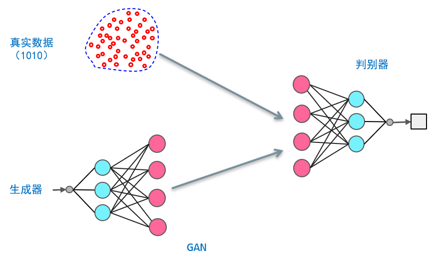
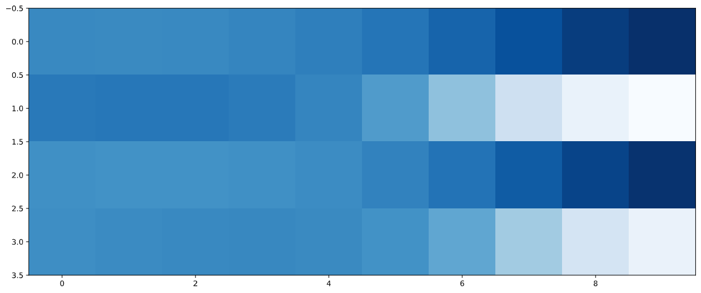
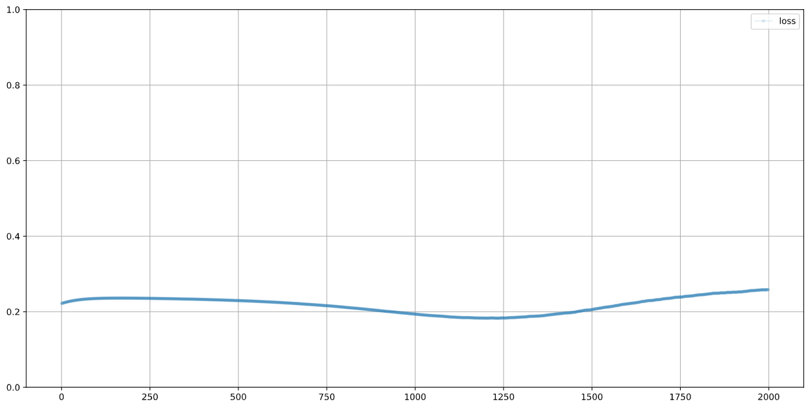

# GAN exercise

> GAN的简单示例

## 1、1010-GAN

使用GAN构建一个能生成形如 “1010” 格式的向量的生成器。

**GAN原理**：同时训练 “1010” 的判别器和生成器，其中判别器用于判断输入是真实样本还是生成样本；生成器用于生成样本，以欺骗判别器。最终获得能成功欺骗过判别器的生成器。原理图如下：



### 1.1 构建生成器和判别器。
```python
# 判别器
class Discriminator(nn.Module):
    def __init__(self):
        # 调用父类的构造函数，初始化父类
        super().__init__()
        # 定义神经网络
        self.model = nn.Sequential(nn.Linear(4, 3), nn.Sigmoid(),
                                   nn.Linear(3, 1), nn.Sigmoid())
        # 创建损失函数
        self.loss_function = nn.MSELoss()
        # 创建优化器，随机梯度下降
        self.optimiser = torch.optim.SGD(self.parameters(), lr=0.01)

        ···

    def train(self, inputs, targets):
        # 计算网络的输出值
        outputs = self.forward(inputs)
        loss = self.loss_function(outputs, targets)
        # 反向传播
        self.optimiser.zero_grad()
        loss.backward()
        self.optimiser.step()
        # 监控训练过程
        self.counter += 1
        if self.counter % 10 == 0:
            self.process.append(loss.item())
            if self.counter % 10000 == 0:
                print('counter = {}'.format(self.counter))

        ···
```

```python
# 生成器
class Generator(nn.Module):
    def __init__(self):
        super().__init__()
        # 定义神经网络
        self.model = nn.Sequential(nn.Linear(1, 3), nn.Sigmoid(),
                                   nn.Linear(3, 4), nn.Sigmoid())
        # 创建优化器，随机梯度下降
        self.optimiser = torch.optim.SGD(self.parameters(), lr=0.01)

        ···

    def train(self, discriminator, inputs, targets):
        # 生成器输出
        gen_data = self.forward(inputs)
        # 判别器预测
        pred_data = discriminator(gen_data)
        # 计算损失
        self.optimiser.zero_grad()
        loss = discriminator.loss_function(pred_data, targets)
        # 监控训练过程
        self.counter += 1
        if self.counter % 10 == 0:
            self.process.append(loss.item())
        # 从判别器开始误差梯度的反向传播
        loss.backward()
        # 用生成器的优化器更新自身参数
        self.optimiser.step()

        ···
```

### 1.2 训练
训练分为三个步骤
1. 使用真实样本训练判别器
2. 使用生成样本训练判别器
3. 训练生成器
    1. target设为 1 可以理解为：奖励成功欺骗过判别器的生成器，目标是使生成器的生成结果，在判别器看来是真实样本(target=1的样本)。
    2. 根据使用判别器的loss function计算loss，梯度反向传播到生成器，利用生成的优化器更新生成器的参数，避免修改判别器的参数。


```python
# 创建判别器和生成器
discriminator = Discriminator()
generator = Generator()

for i in range(10000):
    # 用真实样本训练判别器
    discriminator.train(generate_real(), torch.FloatTensor([1.0]))
    # 用生成样本训练判别器
    discriminator.train(
        generator(torch.FloatTensor([0.5])).detach(), torch.FloatTensor([0.0]))
    # 训练生成器
    generator.train(discriminator, torch.FloatTensor([0.5]),
                    torch.FloatTensor([1.0]))
```

### 1.3 效果分析

生成结果如下：逐渐形成了1010的格式



判别器loss变换如下：



从0.25 下降，表示判别器的识别能力增强，之后再次上升到0.25，表示生成的样本更真实。

收敛到0.25的原因：采用MSE损失函数，在判断不出来的时候选择介于0~1中间的0.5作为输出，此时的loss为0.25

