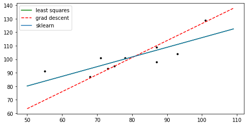

# 梯度下降实现线性拟合

## 1 导入工具库


```python
import numpy as np
import matplotlib.pyplot as plt
from sklearn import linear_model
```

## 2 实验数据点


```python
x = [55, 71, 68, 87, 101, 87, 75, 78, 93, 73]
y = [91, 101, 87, 109, 129, 98, 95, 101, 104, 93]
```

## 3 实现最小二乘法
对于回归方程 $\hat y = w_0 + w_1 * x$ 
1. 最小二乘法要求预测值和真实值的差值平方最小，即令 $w_0, w_1 = argmin \sum_i^n (\hat y_i - y_i)^2$
2. 通过使得 $\frac{\partial \sum_i^n (\hat y_i - y_i)^2}{\partial w_0} = 0$ , $\frac{\partial \sum_i^n (\hat y_i - y_i)^2}{\partial w_1} = 0$ 
3. 求解出 $w_1 = \frac{n\sum x_i y_i -\sum x_i \sum y_i}{n\sum {x_i^2} - (\sum x_i)^2}$，$w_0 = \frac{\sum y_i - w_1 \sum x_i}{n}$


```python
# 最小二乘法
def least_squares_fit(X, Y):
    X_array = np.array(X)
    Y_array = np.array(Y)
    n = len(X)

    w1 = n * np.dot(X_array, Y_array) - np.sum(X_array) * np.sum(Y_array)
    w1 = w1 / (n * np.dot(X_array, X_array) - np.sum(X_array)**2)
    w0 = (np.sum(Y_array) - w1 * np.sum(X_array)) / n

    return w0, w1
```

## 4 实现梯度下降法
对于回归方程 $\hat y = w_0 + w_1 * x$，
1. 设置损失函数 $Loss = \frac{1}{n} \sum_i^n (\hat y_i - y_i)^2$
2. 随机初始化参数 $w_0, w_1$
3. 计算在当前参数 $w_0, w_1$ 下，$Loss$ 对于两个参数的梯度，$\frac{\partial Loss}{\partial w_0} = \frac{2}{n} * \sum \hat y_i - y_i, \frac{\partial Loss}{\partial w_1} = \frac{2}{n} * \sum (\hat y_i - y_i) * x_i$
4. 沿着梯度下降的方向更新参数：$w_0 = w_0 - lr * \frac{\partial Loss}{\partial w_0}, w_1 = w_1 - lr * \frac{\partial Loss}{\partial w_1}$

重复以上步骤，直到满足迭代次数


```python
# 梯度下降法
def grad_descent_fit(X, Y, steps, lr):
    X_array = np.array(X)
    Y_array = np.array(Y)
    n = len(X)
    # 随机初始化参数
    w0 = np.random.random()
    w1 = np.random.random();

    for i in range(steps):
        # 计算梯度
        Loss_array = w1 * X_array + w0 - Y_array
        grad_w0 = 2 * np.sum(Loss_array) / n
        grad_w1 = 2 * np.dot(Loss_array, X_array) / n
        # 更新参数
        w0 = w0 - lr * grad_w0
        w1 = w1 - lr * grad_w1
    return w0, w1
```

## 5 预测 & 分析结果


```python
w0_ls, w1_ls = least_squares_fit(x, y)
w0_gd, w1_gd = grad_descent_fit(x, y, 500, 0.00001)
# 使用sklearn中的线性回归模型预测，作为参考
model = linear_model.LinearRegression()
model.fit(np.array(x).reshape(-1, 1), y)
w1_skl = model.coef_[0]
w0_skl = model.intercept_

print("最小二乘法：y = {} + {} * x".format(w0_ls, w1_ls))
print("梯度下降法：y = {} + {} * x".format(w0_gd, w1_gd))
print("Sklearn：y = {} + {} * x".format(w0_skl, w1_skl))
```

    最小二乘法：y = 44.25604341391219 + 0.7175629008386778 * x
    梯度下降法：y = 0.21888050722481955 + 1.2621894147299484 * x
    Sklearn：y = 44.25604341391218 + 0.7175629008386779 * x

```python
# 作图展示
x_plt = np.arange(50, 110)
y_ls = w1_ls * x_plt + w0_ls
y_gd = w1_gd * x_plt + w0_gd
y_skl = w1_skl * x_plt + w0_skl

plt.figure(figsize=(8, 4))
plt.plot(x, y, 'k.')
plt.plot(x_plt, y_ls, 'g', label='least squares')
plt.plot(x_plt, y_gd, 'r--', label='grad descent')
plt.plot(x_plt, y_skl, label='sklearn')

plt.legend(loc='upper left')
# plt.savefig("./2-res-1.png")
plt.show()
```


   
    


分析结果发现，sklearn和最小二乘法的运算结果基本一致，但是梯度下降的结果有较大的差异。观察图像发现，梯度下降法拟合出的直线也有较高的参考价值，因为它最大限度地让点落在拟合的直线上，且其他点分布在线的两端。因为可以认为该结果应近似于最优解。
