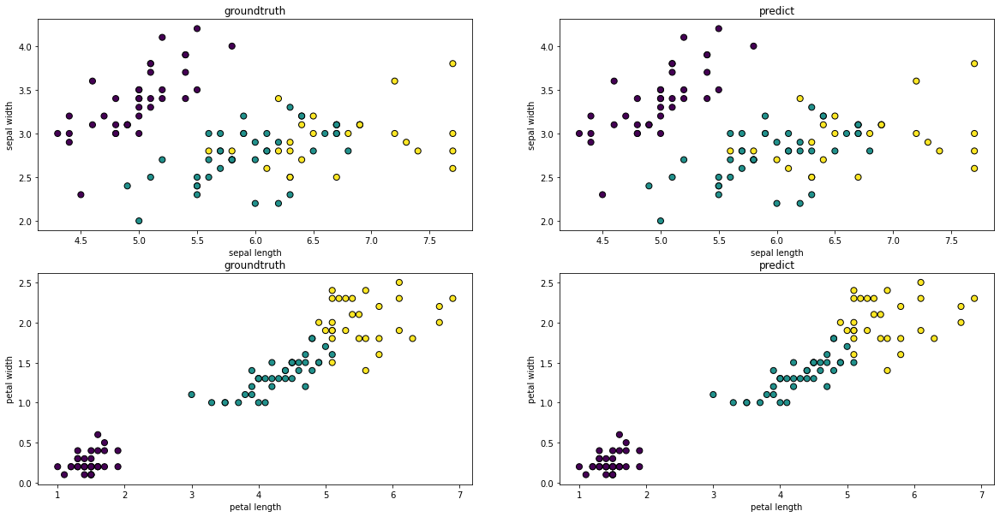

# IRIS SVM 分类
## 1、数据理解

​	鸢尾花数据集是一类多重变量分析的数据集。通过花萼长度，花萼宽度，花瓣长度，花瓣宽度4个属性预测鸢尾花属于(Setosa，Versicolour，Virginica)三个种类中的哪一，因此鸢尾花分类是一个三分类问题。

​	数据集包含150条数据样本，Setosa、Versicolour、Virginica 分别用0、1、2 表示。三种类别各有50条样本。数据集特征的统计信息如下：

| feature      | Min  | Max  | Mean | SD   | Class Correlation |
| ------------ | ---- | ---- | ---- | ---- | ----------------- |
| sepal length | 4.3  | 7.9  | 5.84 | 0.83 | 0.7826            |
| sepal width  | 2    | 4.4  | 3.05 | 0.43 | -0.4194           |
| petal length | 1    | 6.9  | 3.76 | 1.76 | 0.949             |
| petal width  | 0.1  | 2.5  | 1.2  | 0.76 | 0.9565            |

## 2、数据读入
sklearn工具包中包含iris的数据，可以通过`datasets.load_iris()`加载。
## 3、训练集和测试集划分
使用`model_selection.train_test_split()`可以按照比例将数据集划分为训练集和验证集。
## 4、支持向量机
SVM在特征空间中，找到能使分类间隔最大的最优超平面。对于线性不可分的问题，使用核方法，将特征映射到更高维的特征空间中，再构造最优超平面。本实验使用Sklearn中的svm模型，调用svm.SVC()构建模型。接口原型如下：
```python
sklearn.svm.SVC(
    C=1.0,  kernel='rbf',  degree=3,  gamma='auto',  coef0=0.0,
    shrinking=True,  probability=False,  tol=0.001,  max_iter=1,
    cache_size=200,  class_weight=None,  verbose=False,
    decision_function_shape=None,  random_state=None
)
```
    1)	C 是SVM的惩罚参数，当C较小时，对分类错误样本的惩罚就越小，容易欠拟合；当C较大时，对分类错误样本的惩罚越大，容易过拟合。
    2)	kernel：核函数，默认是rbf，可以是linear, poly, rbf, sigmoid, precomputed
    3)	degree：多项式poly函数的维度，默认是3，选择其他核函数时会被忽略。
    4)	gamma： rbf,poly和sigmoid的核函数参数。默认是auto，则会选择1/n_features
    5)	coef0：核函数的常数项。对于poly和 sigmoid有用。
    6)	probability：是否采用概率估计。默认为False
    7)	shrinking：是否采用shrinking heuristic方法，默认为true
    8)	tol：停止训练的误差值大小，默认为1e-3
    9)	cache_size：核函数cache缓存大小，默认为200
    10)	class_weight：类别的权重，字典形式传递。设置第几类的参数C为weight * C
    11)	verbose：允许冗余输出
    12)	max_iter：最大迭代次数。-1为无限制。
    13)	decision_function_shape：ovo,ovr,or None, default=None
    14)	random_state：数据洗牌时的种子值，int值

使用fit()函数，训练SVM。使用不同的核函数，以及调整不同的参数C，进行试验。
## 5、实验结果及分析
1. 使用不同的核函数，进行分类，结果如下：

   | Kernel         | linear | Poly   | rbf    | sigmoid |
   | -------------- | ------ | ------ | ------ | ------- |
   | Train Accuracy | 0.9714 | 0.9810 | 0.9810 | 0.3619  |
   | Test Accuracy  | 0.9556 | 0.9556 | 0.9556 | 0.2667  |

   比较不同的核函数，发现sigmoid的效果很差，其他核函数的效果较好，尤其是线性SVM能达到和非线性相同的泛化能力，因此可以认为数据是线性可分的。模型数据点可视化结果如下：

   

   可以发现在petal length和petal width两个属性构成的二维平面中，在一定的松弛下，数据是线性可分的。这与上面的实验结果相吻合。

2.	以线性核SVM为基础，使用不同的惩罚参数C，进行分类结果如下：

    | C              | 0.01   |  0.5   |   1    |    10   |
    | -------------- | ------ | ------ | ------ | ------- |
    | Train Accuracy | 0.7810 | 0.9714 | 0.9714 | 0.9714  |
    | Test Accuracy  | 0.7333 | 1.0000 | 0.9556 | 0.9556  |
    
    分析不同惩罚项系数的情况：在惩罚项很小时（C=0.01），模型对训练集中预测错误的样本惩罚较小，导致对训练集拟合不充分（欠拟合）导致训练的模型的分类能力较差（仅为0.733）。当惩罚项很大时（C=10），模型对训练集拟合较好，容易发生过拟合。但是本数据集规模较小，线性SVM模型较为简单，过拟合现象并不严重。

